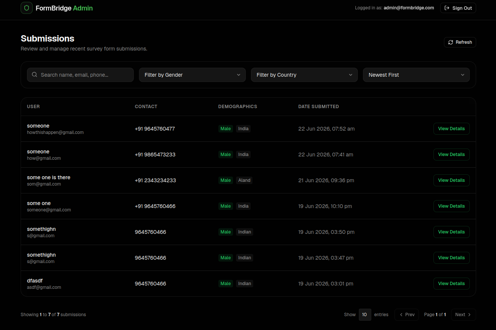
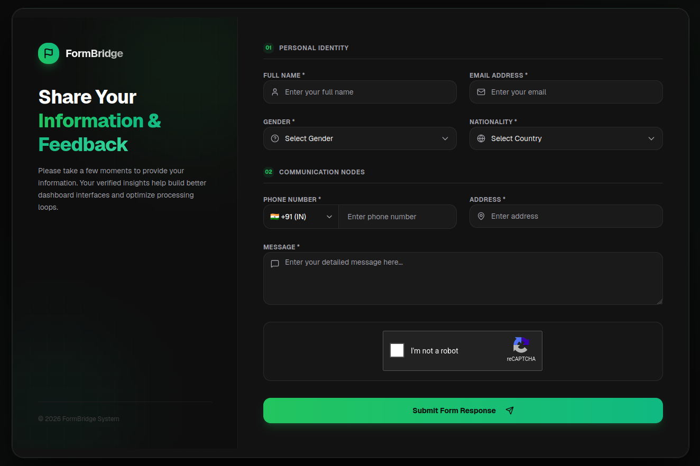

# 🟢 FormBridge

FormBridge is a premium, full-stack survey and form submission management platform designed with a clean, modern **Black & Green** aesthetic. It consists of a secure client-side survey form protected by reCAPTCHA and an administrative dashboard to manage, sort, search, and inspect form submissions.

---

## 📸 Interface Previews

### 📝 Survey Form Page
*A sleek, dark-themed user questionnaire with step-by-step fields, real-time validation, and reCAPTCHA protection.*



### 📊 Admin Dashboard
*An interactive table for administrators to monitor, search, filter, and inspect submissions with detail modal views.*



---

## 🛠 Tech Stack

### Frontend (`/client`)
- **Framework**: React 19 + TypeScript + Vite
- **Styling**: Tailwind CSS v4
- **State Management**: Zustand
- **Form Handling & Validation**: React Hook Form + Zod
- **Icons**: Lucide React
- **HTTP Client**: Axios

### Backend (`/server`)
- **Runtime & Framework**: Node.js + Express (v5) with Clean Architecture
- **Language**: TypeScript
- **Database**: MongoDB (Mongoose)
- **Security**: JWT (Cookie-based), BcryptJS (Password hashing), Google reCAPTCHA v2 Validation
- **Logging**: Winston Logger

---

## 📂 Project Structure

```text
FormBridge/
├── client/              # React Frontend (Vite, TypeScript, Tailwind)
│   ├── src/
│   │   ├── components/  # Reusable UI, Survey, and Admin components
│   │   ├── pages/       # SurveyPage, AdminLoginPage, AdminDashboardPage
│   │   ├── services/    # API calling client layers
│   │   └── validators/  # Zod validation schemas
│   └── package.json
│
├── server/              # Clean Architecture Express Backend (TypeScript)
│   ├── src/
│   │   ├── domain/      # Core Business Logic & Entities
│   │   ├── application/ # Use Cases & Core Rules
│   │   ├── presentation/# Express Routes, Controllers, & Middlewares
│   │   └── infrastructure/# Mongoose Models, DB Connections, & Repositories
│   └── package.json
│
└── assets/              # UI Previews & Screenshots
```

---

## 🚀 Getting Started

### 📋 Prerequisites
Ensure you have the following installed locally:
- **Node.js** (v18+ recommended)
- **npm** or **yarn**
- **MongoDB** running locally or a MongoDB Atlas URI
- Google reCAPTCHA v2 API keys (Site Key & Secret Key)

---

### 🔧 Configuration & Setup

#### 1. Backend Setup
1. Navigate to the server folder:
   ```bash
   cd server
   ```
2. Copy the environment template and configure your secrets:
   ```bash
   cp .env.example .env
   ```
   *Fill out the `.env` variables:*
   - `PORT`: Port number (default `3000`)
   - `MONGODB_URI`: Your MongoDB database connection string
   - `JWT_SECRET`: Secret key used to sign JWT cookies
   - `RECAPTCHA_SECRET_KEY`: Secret key from Google reCAPTCHA console
   - `GOOGLE_RECAPTCHA_SITE_KEY`: Site key from Google reCAPTCHA console

3. Install dependencies:
   ```bash
   npm install
   ```
4. Start the server in development mode:
   ```bash
   npm run dev
   ```

#### 2. Frontend Setup
1. Navigate to the client folder:
   ```bash
   cd client
   ```
2. Verify or create your `.env` file:
   ```env
   VITE_RECAPTCHA_SITE_KEY=your_recaptcha_site_key
   VITE_API_URL=http://localhost:3000/api
   ```
3. Install dependencies:
   ```bash
   npm install
   ```
4. Start the Vite development server:
   ```bash
   npm run dev
   ```

---

## ⚡ Important Commands Reference

| Module | Command | Description |
| :--- | :--- | :--- |
| **Server** | `npm install` | Install all backend dependencies |
| **Server** | `npm run dev` | Run the Express backend in hot-reload mode (`ts-node-dev`) |
| **Server** | `npm run build` | Compile TypeScript into production-ready JavaScript (`dist/`) |
| **Server** | `npm run start` | Start the production-built Express server |
| **Client** | `npm install` | Install all frontend dependencies |
| **Client** | `npm run dev` | Launch the Vite dev server locally (with HMR) |
| **Client** | `npm run build` | Build optimized static files for production |
| **Client** | `npm run lint` | Run ESLint check on source code |
| **Client** | `npm run preview` | Run local web server to preview production build |
